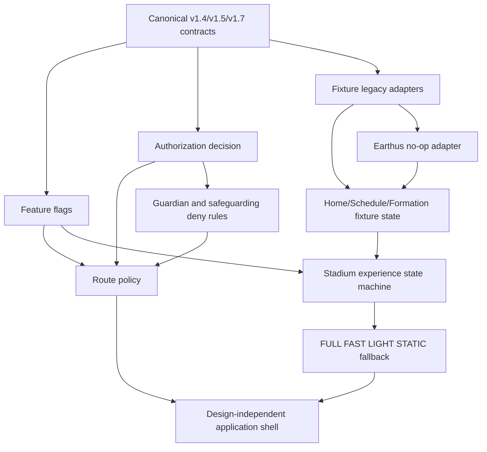

# Implementation Dependency Graph

```mermaid
flowchart TD
  C[Canonical v1.4/v1.5/v1.7 contracts] --> F[Feature flags]
  C --> A[Authorization decision]
  C --> L[Fixture legacy adapters]
  F --> R[Route policy]
  A --> R
  L --> H[Home/Schedule/Formation fixture state]
  H --> S[Stadium experience state machine]
  F --> S
  S --> T[FULL FAST LIGHT STATIC fallback]
  A --> G[Guardian and safeguarding deny rules]
  G --> R
  L --> E[Earthus no-op adapter]
  E --> H
  R --> UI[Design-independent application shell]
  T --> UI
```

The graph intentionally stops before production adapters, database migrations, Community writes, media migration, or final visual asset rendering.
